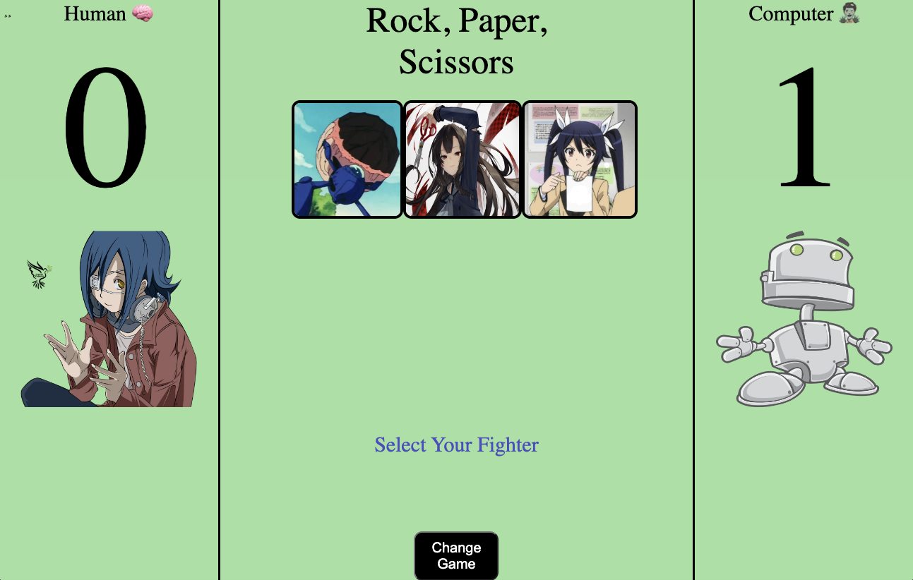
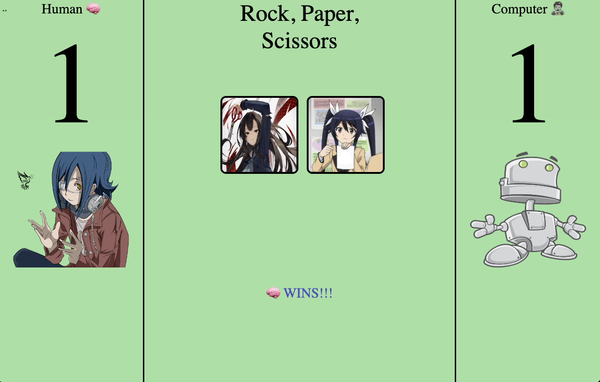

## Overview
- This app features a game of Rock, Paper, Scissors. There are 2 modes...the classic version and the difficult version to choose from. The game is anime themed and uses a combination of javascript, css, and html. 

## Setup Instructions
- Fork this project to your own Github account.
- Clone the repository to your local machine using - your computers terminal.
- cd into the project.
- Type: open index.html

## Preview

## Context
- I am a student in my 5th weekof the Turing School of Software and Design front-end program. We had 7 days to complete this project and I spent about 20 hours of work time.

## Challenges
- I ran through some challenges in the beginning of linking the data model with the DOM and styling with display flex.

## Wins
- There were a lot of instances that felt like wins for me. But one of the biggest wins was smoothly updating the DOM and making the game playable through the data model.

## Contributors
- [Tom Doder](https://www.linkedin.com/in/tom-doder/)
